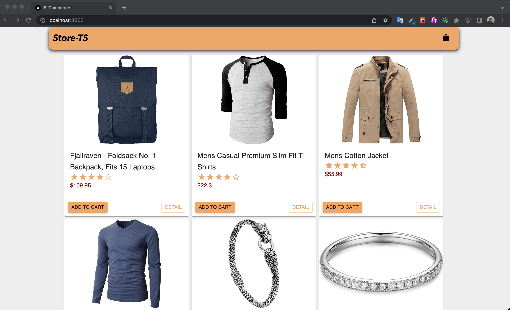
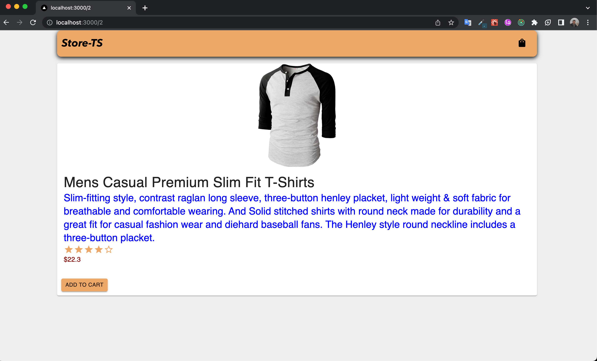
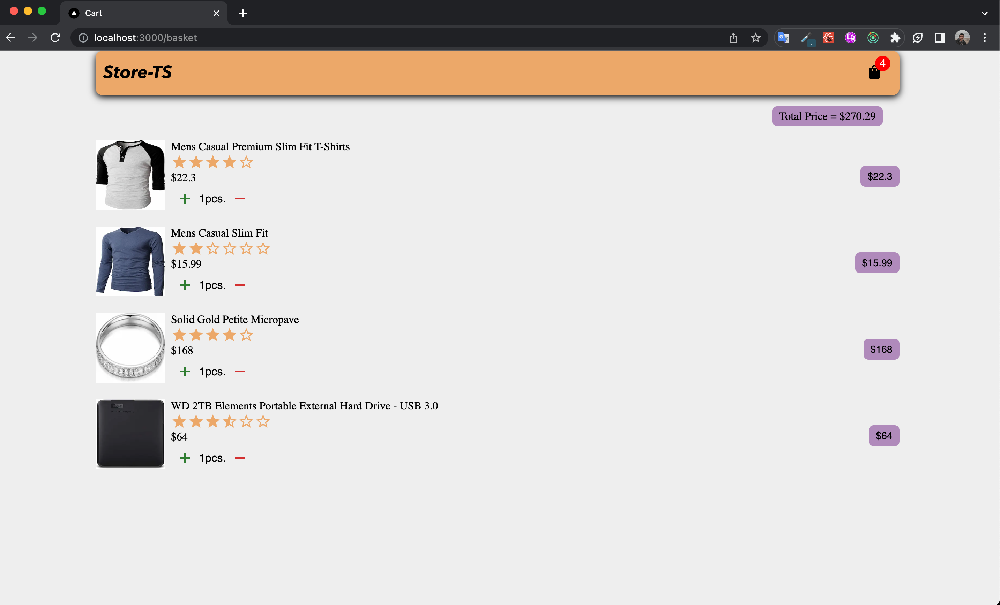

# E-Commerce with Next.js

This is a [Next.js](https://nextjs.org/) project bootstrapped with [`create-next-app`](https://github.com/vercel/next.js/tree/canary/packages/create-next-app).

## Getting Started

Clone repository your directory
Then, run the development server:

```bash
npm run dev
# or
yarn dev
# or
pnpm dev
```

### Usage Tech

- [Next.js](https://nextjs.org/)
- [Material UI](https://mui.com/)
- [Redux](https://redux.js.org/)
- [TypeScript](https://www.typescriptlang.org/)

### API

- [Fake Store](https://fakestoreapi.com/)

### Preview

- [Go Website](https://storetsnext.netlify.app)

### ScreenShots




